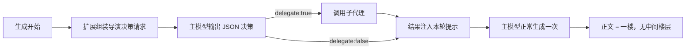

# POV Agents / 局部视角代理

让**主 AI 当导演**、按需把「某个角色的有限视角」外包给一个临时子代理的 SillyTavern 扩展。

主 AI 掌握完整上下文（角色卡、命中的世界书、聊天记录），它自己决定要不要咨询子代理、以及**自己挑选**要传哪些材料。子代理只看得到主 AI 给它的那一点信息，因此不会“开天眼”。

---

## 安装

### 方式一：从 Git URL 安装（推荐）

1. 打开 SillyTavern → **扩展**（顶栏拼图图标）→ **安装扩展**
2. 在 **扩展程序的 URL** 里粘贴本仓库地址，例如：

   ```
   https://github.com/你的用户名/pov-agents
   ```

3. 点 **安装** → 安装完成后在扩展列表里**启用 POV Agents**
4. **刷新页面**（`Ctrl+Shift+R`）

> SillyTavern 会把仓库浅克隆到扩展目录，并要求**仓库根目录存在 `manifest.json`**（本仓库已满足）。

### 方式二：手动安装

把本仓库整个文件夹放到：

```
SillyTavern/public/scripts/extensions/third-party/pov-agents/
```

确认该目录下直接就是 `manifest.json` 和 `index.js`，然后刷新页面。

### 更新

- 从 Git 安装：扩展面板里点 **更新**
- 手动安装：重新下载覆盖文件夹后刷新页面

---

## 快速开始

1. 扩展设置里勾选 **允许主模型按需调用局部视角子代理**
2. **无需配置**：默认连接方式就是「自定义 API」且全部留空，此时子代理自动继承主 AI 的接口、密钥、模型与预设
3. 正常发消息，观察右上角提示：
   - `已调用局部视角子代理：正在推演 <角色> …` → 本轮发生了委派
   - `本轮未委派（导演判断无需子代理）` → 本轮没有委派
4. 发生委派的消息**底部**会出现一个折叠条，点开可以看到：

   ```
   🎭 局部视角子代理调用详情（1 次 · 推演洛晴雪…，点击展开）
     → task             （主 AI 给子代理的提问）
     → context          （主 AI 挑选的上下文）
     → role_instructions（角色性格与认知边界）
     ← 子代理返回        （子代理的完整原文）
   ```

---

## 设置项

| 设置项 | 说明 |
|---|---|
| 允许主模型按需调用局部视角子代理 | 总开关 |
| 更积极调用 | 提示词层面提高委派概率 |
| 每轮必委派（默认开） | 跳过“是否需要”的判断，每轮都委派；想要纯按需可关掉 |
| 在消息内显示子代理调用详情 | 是否显示折叠条 |
| 调用子代理时弹出提示 | 是否弹 toast |
| 子代理最大回复长度 | 子代理输出上限（token）。**推理模型建议 16384 以上** |

### 子代理连接方式

- **自定义 API（默认）**：直接填 API 地址 / 模型 / API Key / 预设；**全部留空即继承主 AI**，所以零配置就能用
- **使用主模型连接**：子代理与主 AI 共用连接（等价于上一项全留空）
- **使用 Connection Manager 配置**：密钥由 SillyTavern Secret 管理（推荐注重安全时使用）

> **留空即继承主 AI**：地址留空 → 用主 AI 的接口与密钥；模型留空 → 用主 AI 的模型；预设留空 → 沿用主 AI 当前参数。
> 只有当地址与主 AI **不同**时才必须填 API Key（子代理读不到主 AI 的密钥）。
> 设置面板底部有「**测试子代理连接**」按钮可直接验证。

---

## 设置界面

扩展面板里只保留常用开关（启用 / 每轮必委派 / 固定扮演 / 显示调用详情），其余配置都在「**详细设置**」按钮弹出的悬浮窗里，分四个标签页：

| 标签页 | 内容 |
|---|---|
| 连接 | 连接方式、自定义 API（地址 / Key / 模型 / 预设）、Connection Manager 配置 |
| 固定扮演 | 角色名、固定设定、固定推演任务 |
| 提示词模板 | 六段可编辑提示词（带生效范围标记） |
| 高级 | 更积极调用、不占楼层、调用提示、最大回复长度 |

> 提示词模板带「**普通模式专用**」「**固定扮演专用**」标记：模板 ② 只在普通模式生效（固定模式下改用 ⑤），模板 ⑤⑥ 只在固定扮演模式生效。

---

## 固定扮演模式

适合**只有两个人的故事**：让子代理**始终扮演同一个角色**，角色设定由你预先写死，不受本轮剧情影响。

开启后（设置面板「固定扮演模式」折叠区）：

| 字段 | 说明 |
|---|---|
| 启用固定扮演模式 | 开关 |
| 角色名 | 仅用于显示（折叠条会显示"固定扮演：xxx"） |
| **固定设定** | 你预先写好的权威设定：身份、性格、说话习惯、认知边界、禁忌…… |
| 固定推演任务 | 留空则用默认："以该角色的有限视角，推演其此刻会注意到什么、会怎么想、最可能怎么做。" |

**这个模式下主 AI 的职责被收窄**：

- 它**只**需要提供【客观事实摘要】+【该角色能感知到的信息】（决策格式会切换成只要求 `context`）
- 它**不再**提供角色设定与推演任务 —— 这两项由你写死
- 即使它硬塞了性格/心理推测，子代理也会**忽略**：系统提示里会追加「固定设定优先」声明，明确"材料中关于该角色性格、心理、动机、情绪的推测一律忽略，只采纳客观事实与感知；冲突时以固定设定为准"

> 相关提示词同样可改：模板 ⑤「固定扮演 — 导演决策格式」、模板 ⑥「固定扮演 — 设定优先声明」。

---

## 提示词模板（可自行修改）

扩展发给模型的所有提示词都暴露在设置面板的「**提示词模板（可自行修改）**」折叠区，共四段：

| 模板 | 作用 | 占位符 |
|---|---|---|
| ① 导演决策 — 系统提示 | 让主 AI 判断"本轮是否需要子代理" | — |
| ② 导演决策 — 参数格式与纪律 | 规定 JSON 结构与参数纪律 | — |
| ③ 子代理 — 系统提示 | 子 AI 的角色约束与输出格式 | `{{roleInstructions}}` |
| ④ 结果回注 — 给主 AI 的使用要求 | 子代理结果注入本轮提示的包装 | `{{keyPoints}}`、`{{keyPointsBlock}}`、`{{childReply}}` |

- **留空 = 使用内置默认值**；填了就用你的
- 每项下方有「**恢复默认**」按钮（点完记得再点「保存设置」）
- 未修改的项不会写进设置文件，只有真正改过的才会保存

> 提示：③ 里的 `### 三条结论` 那一行是"主 AI 真正用上子代理"的关键（该摘要会被单独抽出并高亮注入），改它时建议保留这个结构。

---

## 工作原理



- **不使用** SillyTavern 的 function calling，因此**不会**产生“空回复楼 / 工具结果楼”这类中间楼层
- 子代理结果以 `assistant` 角色注入到对话**最末尾**，紧贴生成位置，避免被预设尾部模板淹没
- 子代理被要求输出 `### 三条结论`（认知边界 / 情绪身体状态 / 最可能行为方向），该摘要会被单独注入

---

## 隐私与边界

- 子代理**不会**自动获得角色卡、世界书或聊天记录；只有主 AI 明确写进 `context` 的内容它才看得到
- 使用「自定义 API」时，API Key 保存在本机 SillyTavern 用户设置文件中；需要加密存储请改用 Connection Manager
- 每轮委派会额外产生 1～2 次模型请求（决策 + 子代理），有额外延迟与 token 消耗
- 子代理只提供**建议**，主 AI 保留对事实与叙事的最终决定权

---

## 兼容性

- 需要较新的 SillyTavern（开发与验证版本 1.13.4）
- 子代理使用 Chat Completion 接口；「自定义 API」目前面向 **OpenAI 兼容**端点
- 若子模型是推理模型，思考 token 会先占用预算 —— 请把「子代理最大回复长度」调大

## 许可

MIT，见 `LICENSE`。
